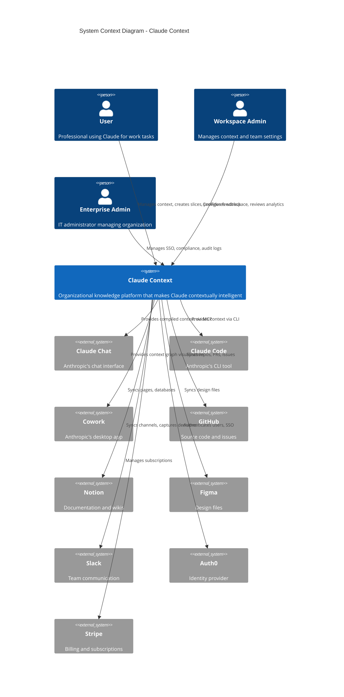
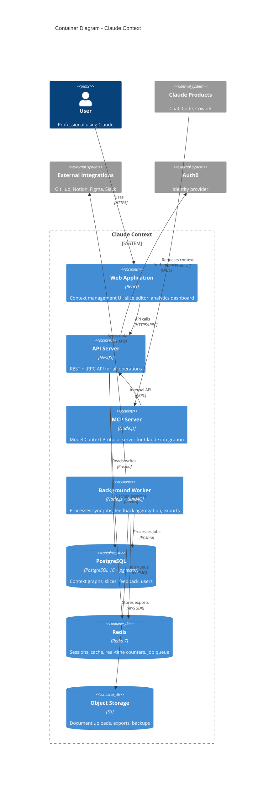
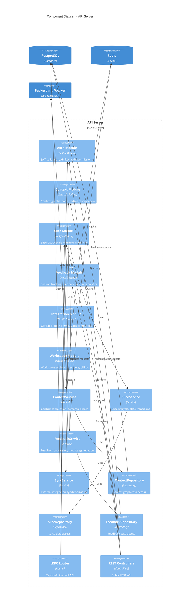
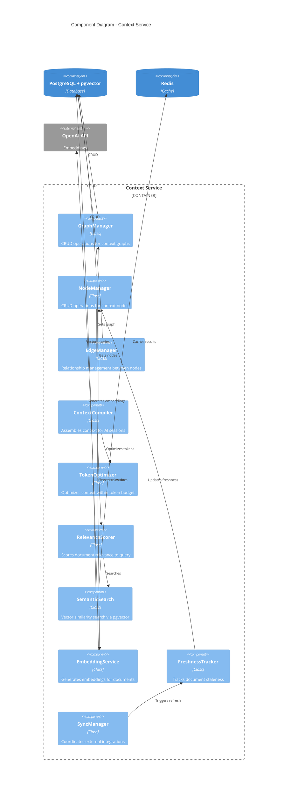
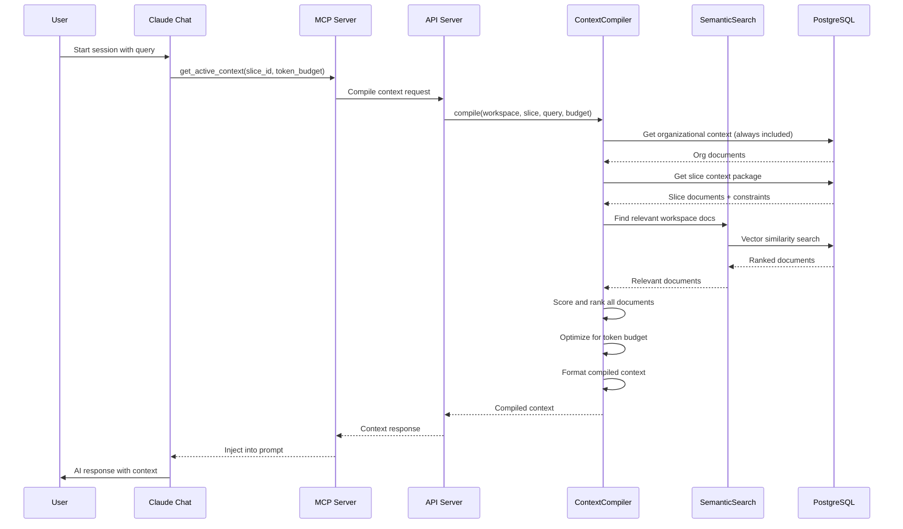
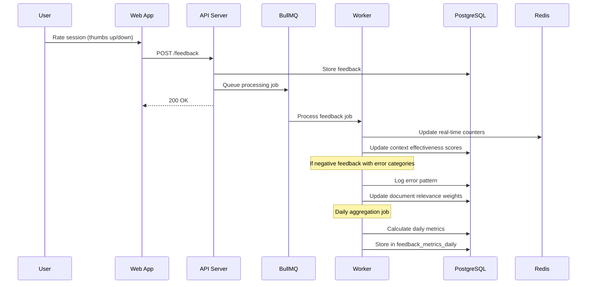

# Claude Context: C4 Architecture Diagrams

## Level 1: System Context Diagram

Shows Claude Context and its relationships with users and external systems.



## Level 2: Container Diagram

Shows the major containers (applications, services, data stores) within Claude Context.



## Level 3: Component Diagram - API Server

Shows the internal components of the API Server container.



## Level 3: Component Diagram - Context Service

Detailed view of the Context Service and its subcomponents.



## Data Flow: Context Compilation

Shows how context is compiled for an AI session.



## Data Flow: Feedback Collection

Shows how feedback flows through the system.



## Deployment Architecture

```mermaid
C4Deployment
    title Deployment Diagram - Claude Context (AWS)

    Deployment_Node(aws, "AWS", "Cloud Provider") {
        Deployment_Node(region_us, "us-east-1", "Primary Region") {
            Deployment_Node(vpc, "VPC", "Network Isolation") {
                Deployment_Node(public_subnet, "Public Subnet") {
                    Deployment_Node(alb, "Application Load Balancer") {
                        Container(lb, "ALB", "Load Balancer", "Routes traffic, SSL termination")
                    }
                }

                Deployment_Node(private_subnet, "Private Subnet") {
                    Deployment_Node(ecs, "ECS Cluster") {
                        Container(api_service, "API Service", "Fargate", "3 tasks, auto-scaling")
                        Container(worker_service, "Worker Service", "Fargate", "2 tasks")
                        Container(mcp_service, "MCP Service", "Fargate", "2 tasks")
                    }
                }

                Deployment_Node(data_subnet, "Data Subnet") {
                    Deployment_Node(rds, "RDS") {
                        ContainerDb(postgres_primary, "PostgreSQL Primary", "db.r6g.xlarge", "Primary database")
                        ContainerDb(postgres_replica, "PostgreSQL Replica", "db.r6g.large", "Read replica")
                    }
                    Deployment_Node(elasticache, "ElastiCache") {
                        ContainerDb(redis_cluster, "Redis Cluster", "cache.r6g.large", "3-node cluster")
                    }
                }
            }
        }

        Deployment_Node(global, "Global Services") {
            Deployment_Node(cloudfront, "CloudFront") {
                Container(cdn, "CDN", "CloudFront", "Static assets, caching")
            }
            Deployment_Node(s3_node, "S3") {
                ContainerDb(s3_bucket, "S3 Bucket", "S3", "Documents, exports")
            }
        }
    }

    Rel(cdn, lb, "Routes API requests")
    Rel(lb, api_service, "Load balances")
    Rel(api_service, postgres_primary, "Writes")
    Rel(api_service, postgres_replica, "Reads")
    Rel(api_service, redis_cluster, "Sessions, cache")
    Rel(worker_service, postgres_primary, "Processes jobs")
    Rel(worker_service, s3_bucket, "Stores exports")
```

## References

- [C4 Model](https://c4model.com/)
- [Mermaid C4 Diagrams](https://mermaid.js.org/syntax/c4.html)
- [ADR-014: Context Graph Storage](../adrs/ADR-014-context-graph-storage.md)
- [ADR-015: Slice State Machine](../adrs/ADR-015-slice-state-machine.md)
- [ADR-016: Feedback Pipeline](../adrs/ADR-016-feedback-collection-pipeline.md)
